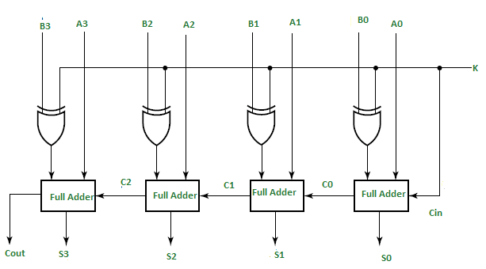

# Integer Representation and ECC

## Conversion From 2's-complement to Decimal

Example:  10110101

### 1. Change its sign

01001010 + 1 = 01001011 = 1 + 2 + 8 + 64 = 75

10110101 = - 75

### 2. Horner's rule

10110101

| 7   | 6   | 5   | 4   | 3   | 2   | 1   | 0   |
|:---:|:---:|:---:|:---:|:---:|:---:|:---:|:---:|
| 1   | 0   | 1   | 1   | 0   | 1   | 0   | 1   |

$$
-2^7+2^5+2^4+2^2+2^0=-128+32+16+4+1=-75
$$

證明：

> 假設原二進位數 $a_na_{n-1}...a_0$ 其中 $a_n=1$
>
> $-(1+\sum_{k=0}^n (1-a_k)\times2^k)$ 先做二補數轉正再取負號
>
> $=-(1+\sum_{k=0}^n2^k-\sum_{k=0}^na_k2^k)$ 展開
>
> $=-(1+(2^n-1)-\sum_{k=0}^na_k2^k)$ 等比級數
>
> $=-(2^n-\sum_{k=0}^na_k2^k)$ 整理
>
> $=-2^n+\sum_{k=0}^na_k2^k$

## Error Correcting Code (ECC)

ECC DRAM uses SEC/DED with C check bits protecting D data bits

D: Number of data bits

C: Number of bits required to correct a single bit error

$$
2^C-1\geq D+C
$$

說明：

$2^C\geq D+C+1$ 

Data 有 D 種錯誤的可能，Check 有 C 種錯誤的可能，另外全對也是一種可能，因此一共有 D+C+1 種可能。而這些可能必需由 C 個 check bits 表示，一共有 $2^C$ 種可能

**注意 Bit position 要從 1 開始**

| Bit position | 12   | 11   | 10   | 9    | 8    | 7    | 6    | 5    | 4    | 3    | 2    | 1    |
| ------------ |:----:|:----:|:----:|:----:|:----:|:----:|:----:|:----:|:----:|:----:|:----:|:----:|
| position     | 1100 | 1011 | 1010 | 1001 | 1000 | 0111 | 0110 | 0101 | 0100 | 0011 | 0010 | 0001 |
| check bit    |      |      |      |      | C8   |      |      |      | C4   |      | C2   | C1   |
| data bit     | D8   | D7   | D6   | D5   |      | D4   | D3   | D2   |      | D1   |      |      |

C1 = D7 xor D5 xor D4 xor D2 xor D1

C2 = D7 xor D6 xor D4 xor D3 xor D1

C4 = D8 xor D4 xor D3 xor D2

C8 = D8 xor D7 xor D6 xor D5

驗證：

重新計算一次並與舊有的 Check bit 做 xor，如果出來是 0 代表無 bit error ，如果是 1 代表第 1 個 bit 出錯 (C1 錯)，如果算出來是 6 代表第 6 個 bit 出錯 (D3 出錯)

**Example**

原資料： 001101001111 (check = 0111)

做驗證：得 0001

0111 xor 0001 = 0110 → 第 6 個 bit 出錯 → D3 出錯

## Adder

圖片來源：[alex9ufo 聰明人求知心切: Verilog 4-bit binary Adder-Subtractor](http://alex9ufoexploer.blogspot.com/2020/01/verilog-4-bit-binary-adder-subtractor.html)

相加時 K 取 0 、相減取 1

計算後有四個 Flags

+ Flag Z: zero flag (計算結果為零時設為1)

+ Flag V: overflow flag (假設計算時為 signed number 則 overflow 發生時設為1)

+ Flag C: carry out flag (最後多出來的一個位元，圖中以 cout 表示，用來給 unsigned number 判斷有沒有溢位)

+ Flag N: sign flag (表示計算結果正負，若為負設為 0，圖中以 S3 表示)

其中

+ Z flag 的算法：S0' and S1' and S2' and S3'

+ V flag 的算法：如果兩個正數相加時出現負數 或 如果兩個負數相加時出現正數 或 正的減負的出現負數 或 負的減正的出現正數。
  另一種計算方式是將 CN 與 CN-1 取 XOR

### Overflow 的判斷方法

+ singed number: 利用 overflow flag 做判斷

+ unsigned number: 利用 carry flag 做判斷，當兩數相加時 carry flag = 1 表示溢位；若兩數相減則 carry flag = 0 表示溢位
